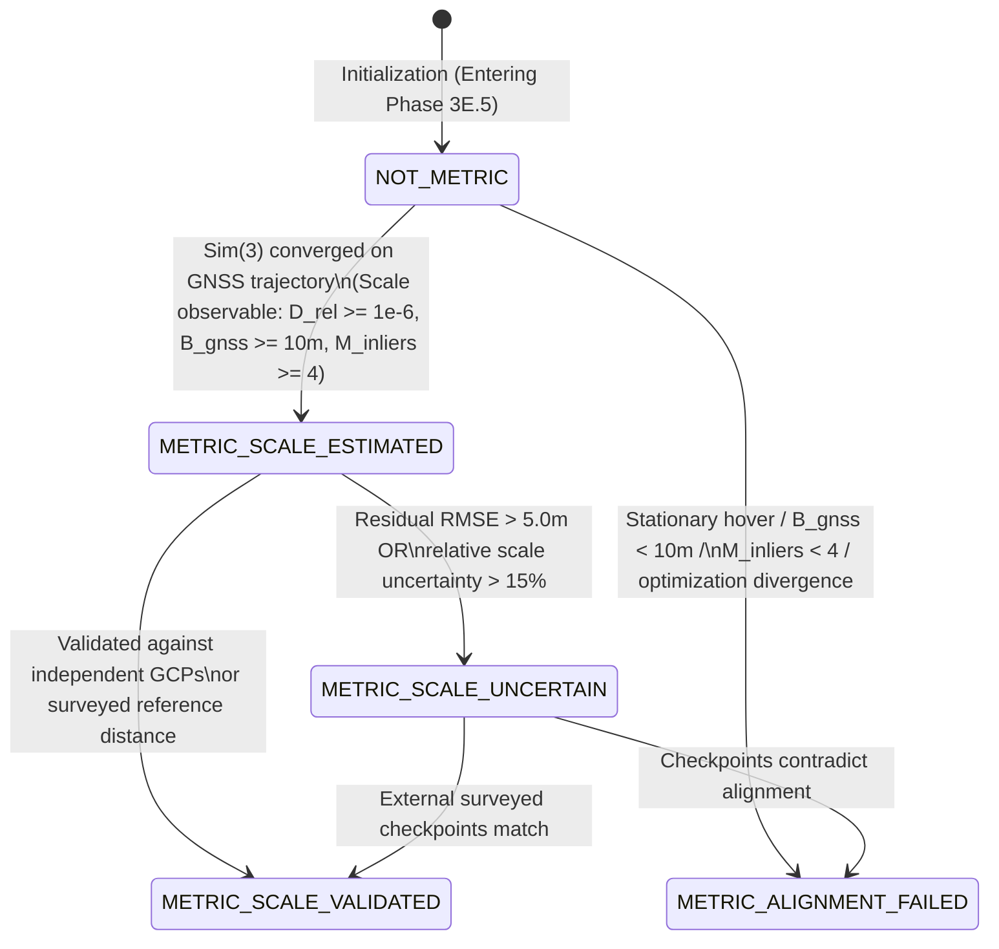

# Phase 3E.5 — Geospatial & Metric Reconstruction
## Architecture & Mathematical Contract Specification (Final Forensic Revision)

**Status**: CONTRACT & DESIGN SPECIFICATION ONLY  
**Baseline Locks**:
- Phase 3E.2 (Dense Point Generation): locked lineage `cfea803`
- Phase 3E.3 (Dense Fusion): locked lineage `a05e331`
- Phase 3E.4 Step 2 (Surface Reconstruction): locked at `cfea803`
- Phase 3E.4 Step 3 (Texture Association): locked at `43b6b9d`
- Phase 3E.4 Step 4 (Texture Reconstruction): locked at `dd506bd`
- Clean Repository State: `46fcc74` / `dd506bd`  
**Implementation State**: DESIGN & CONTRACT ONLY / NO PRODUCTION CODE / NO COMMITS

---

## 1. Executive Summary & Problem Definition

Monocular Structure-from-Motion (SfM) and Multi-View Stereo (MVS) pipelines reconstruct 3D scene geometry in an **arbitrary, dimensionless gauge**:
$$\mathbf{X}_{\text{rec}} \in \mathbb{R}^3, \quad [L] \text{ arbitrary}, \quad \text{depth\_unit} = \text{RECONSTRUCTION\_UNITS}, \quad \text{is\_metric\_scale} = \text{False}$$
In this gauge, absolute orientation relative to true North, absolute translation relative to Earth, and physical metric scale are unconstrained.

The mission of **Phase 3E.5 (Geospatial & Metric Reconstruction)** is to establish a mathematically rigorous, auditable bridge between this arbitrary reconstruction gauge $\mathbf{X}_{\text{rec}}$ and the Earth-centered, Earth-fixed geospatial reference frame $\mathbf{X}_{\text{geo}}$.

### 1.1 The Fundamental Geospatial Principle
> [!CRITICAL]
> **GNSS and Flight Telemetry are Observation Sources, NOT Ground Truth.**  
> Drone-mounted GNSS receivers, consumer IMUs, and barometric altimeters are subject to multipath reflections, clock drift, satellite geometry dilution of precision (PDOP/GDOP), lever-arm offsets, and synchronization latency.  
> **The system MUST NEVER simply substitute GPS coordinates into 3D points or treat raw telemetry as exact truth.**  
> Instead, the system must formulate and solve an **explicit overdetermined, robustly-weighted spatial estimation problem** between the reconstruction gauge and the local topocentric geospatial coordinate frame.

---

## 2. Coordinate System Hierarchy & Gauge Formalism

To ensure numerical stability, prevent catastrophic floating-point cancellation, and preserve physical rigor, Phase 3E.5 strictly adheres to the coordinate transformation hierarchy established in Phase 1 ([`docs/architecture/COORDINATE_NORMALIZATION.md`](file:///c:/Users/mohit/OneDrive/Desktop/SIH%2026158/docs/architecture/COORDINATE_NORMALIZATION.md)):

```
Reconstruction Gauge X_rec (Dimensionless [L])
                │
                │  7-DoF Sim(3) Alignment: X_geo = s * R * X_rec + t
                ▼
Local Topocentric ENU Frame X_geo (Metric [m], Tangent Plane)
                │
                │  Rigid Orthonormal Transform (Inverse of Phase 1 Eq 85)
                ▼
Global Geocentric ECEF (EPSG:4978, Metric [m])
                │
                │  Closed-Form Bowring Inversion
                ▼
Global Geodetic WGS84 (EPSG:4326, Lat φ, Lon λ, Height h [m])
```

### 2.1 Formal Coordinate Frames
1. **Reconstruction Frame ($\mathcal{F}_{\text{rec}}$)**:
   - Arbitrary monocular SfM Euclidean coordinate frame.
   - Coordinates $\mathbf{X}_{\text{rec}} = (x_{\text{rec}}, y_{\text{rec}}, z_{\text{rec}})^T$.
   - Scale factor is arbitrary ($s > 0$ required to convert to metres).
2. **Local Topocentric East-North-Up Frame ($\mathcal{F}_{\text{ENU}}$)**:
   - Metric Cartesian Euclidean frame $\mathbb{R}^3$ defined tangent to the WGS84 ellipsoid at a reference anchor point $(\phi_0, \lambda_0, h_0)$.
   - Axes: $+E$ (East), $+N$ (North, true geodetic meridian), $+U$ (Up, ellipsoidal normal).
   - Handedness: Right-handed orthonormal basis ($\mathbf{e} \times \mathbf{n} = \mathbf{u}, \det(\mathbf{R}) = +1$).
   - **Crucial Rule**: **All Euclidean metric optimizations and residual evaluations MUST occur in $\mathcal{F}_{\text{ENU}}$. WGS84 geodetic coordinates (degrees) MUST NEVER be used as metric optimization variables.**
3. **Global Earth-Centered, Earth-Fixed Frame ($\mathcal{F}_{\text{ECEF}}$, EPSG:4978)**:
   - Origin at Earth center of mass; axes defined by IERS/WGS84 standards.
4. **Global Geodetic Frame ($\mathcal{F}_{\text{WGS84}}$, EPSG:4326)**:
   - Latitude $\phi \in [-\pi/2, \pi/2]$, Longitude $\lambda \in [-\pi, \pi]$, Ellipsoidal Height $h \in \mathbb{R}$.

---

## 3. Transformation Model Comparative Analysis & Selection

Let $\mathbf{X}_{\text{rec}} \in \mathcal{F}_{\text{rec}}$ and $\mathbf{X}_{\text{geo}} \in \mathcal{F}_{\text{ENU}}$. We compare four candidate coordinate transformation formulations:

| Candidate Model | Mathematical Degrees of Freedom | Invariants Preserved | Scientific Evaluation & Failure Risks | Selection Status |
| :--- | :--- | :--- | :--- | :--- |
| **Option A: Rigid $\mathrm{SE}(3)$** | 6 DoF: $\mathbf{X}_{\text{geo}} = \mathbf{R} \mathbf{X}_{\text{rec}} + \mathbf{t}$ | Metric lengths, angles, parallelism | Fails fundamentally: Monocular SfM gauge does not have a 1.0 metre scale. Enforcing $s \equiv 1.0$ corrupts real-world dimensions. | **REJECTED** |
| **Option B: Similarity $\mathrm{Sim}(3)$** | 7 DoF: $\mathbf{X}_{\text{geo}} = s \mathbf{R} \mathbf{X}_{\text{rec}} + \mathbf{t}$ | Angles, shape ratios, collinearity | **Physically and mathematically optimal**. Exactly matches the unobservable gauge degrees of freedom of monocular projective reconstruction. | **SELECTED** |
| **Option C: General Affine $\mathrm{Aff}(3)$** | 12 DoF: $\mathbf{X}_{\text{geo}} = \mathbf{A} \mathbf{X}_{\text{rec}} + \mathbf{t}$ | Parallelism, barycentric ratios | **Forbidden**. Allows non-uniform scaling ($s_x \neq s_y \neq s_z$) and non-orthogonal shearing. Shearing artificially deforms 3D geometry to hide unmodeled SfM drift or GPS errors. | **FORBIDDEN** |
| **Option D: Nonlinear Thin-Plate Spline Warp** | $\infty$ DoF / Non-parametric | Local continuity only | **Forbidden**. Arbitrarily warps reconstructed geometry to conform to noisy GNSS multipath, destroying structural straightness and planarity. | **FORBIDDEN** |

### 3.1 Mathematical Definition of the Selected Model: $\mathrm{Sim}(3)$
The transformation from reconstruction coordinates to local ENU coordinates is governed strictly by the 7-DoF similarity group $\mathrm{Sim}(3)$:
$$\mathbf{X}_{\text{geo}} = \mathcal{T}_{\text{Sim}(3)}(\mathbf{X}_{\text{rec}}; s, \mathbf{R}, \mathbf{t}) = s \mathbf{R} \mathbf{X}_{\text{rec}} + \mathbf{t}$$
where:
- $s \in \mathbb{R}_{>0}$ is the global isotropic metric scale factor ($[\text{metres} / \text{reconstruction-unit}]$).
- $\mathbf{R} \in \mathrm{SO}(3)$ is the $3 \times 3$ orthonormal rotation matrix ($\mathbf{R}^T \mathbf{R} = \mathbf{I}_3, \det(\mathbf{R}) = +1$).
- $\mathbf{t} \in \mathbb{R}^3$ is the translation vector in local ENU coordinates ($[\text{metres}]$).

The inverse transformation is exact:
$$\mathbf{X}_{\text{rec}} = \mathcal{T}_{\text{Sim}(3)}^{-1}(\mathbf{X}_{\text{geo}}) = \frac{1}{s} \mathbf{R}^T (\mathbf{X}_{\text{geo}} - \mathbf{t})$$

---

## 4. Telemetry Observation Model & Sensor Synchronization

### 4.1 GNSS Observation Formulation & Accuracy Semantics
Let $K$ camera frames be successfully reconstructed with optical camera centers in reconstruction coordinates $\mathbf{C}_{\text{rec}, i} \in \mathbb{R}^3$ at optical shutter trigger times $t_i$ ($i = 1, \dots, K$).

For each reconstructed camera $i$, flight telemetry provides (or allows interpolation of) a GNSS antenna observation in local ENU coordinates $\mathbf{z}_{\text{gnss}, i} \in \mathbb{R}^3$ accompanied by an empirical measurement covariance matrix $\boldsymbol{\Sigma}_{\text{gnss}, i} \in \mathbb{R}^{3 \times 3}$.

#### 4.1.1 Explicit GNSS Accuracy Interpretation Policy
> [!CRITICAL]
> **Vendor "Accuracy" Metrics Are NOT Automatically Gaussian $1\sigma$.**  
> Drone telemetry and NMEA/u-blox streams report position quality under heterogeneous definitions (e.g. CEP 50%, 2DRMS 95%, horizontal accuracy estimate hAcc).  
> The system **MUST NOT silently treat an unspecified vendor "accuracy" field as Gaussian $\sigma$** without an explicit contract conversion or documented fallback.

We define an explicit semantic interpretation taxonomy for reported GNSS accuracy:
1. **`ONE_SIGMA_STANDARD_DEVIATION`**: Reported value represents 1-sigma standard deviation ($\sigma \approx 68.3\%$ confidence for 1D Gaussian). Used directly: $\sigma_h = \text{accuracy}_h$.
2. **`CEP_50` (Circular Error Probable 50%)**: Radius of a circle centered at the true position containing 50% of horizontal fixes. Under an isotropic 2D Gaussian distribution, the 1-sigma standard deviation is derived mathematically as:
   $$\sigma_{1\sigma} = \frac{\text{CEP}_{50}}{\sqrt{-2 \ln(1 - 0.50)}} = \frac{\text{CEP}_{50}}{\sqrt{2 \ln 2}} \approx \frac{\text{CEP}_{50}}{1.17741}$$
3. **`TWO_SIGMA_95` (2-Sigma / 95% Confidence Radius)**: Circle containing 95% of fixes. Under a 2D Gaussian distribution:
   $$\sigma_{1\sigma} = \frac{r_{95}}{\sqrt{-2 \ln(1 - 0.95)}} = \frac{r_{95}}{\sqrt{-2 \ln 0.05}} \approx \frac{r_{95}}{2.44775}$$
   For 1D vertical altitude with 95% bound ($2\sigma$): $\sigma_v = r_{95, v} / 1.95996 \approx r_{95, v} / 2.0$.
4. **`RMS_ERROR`**: Direct Root-Mean-Square horizontal error ($\sigma_{1\sigma} \approx \text{RMS}$).
5. **`UNKNOWN_VENDOR_ACCURACY`**: Unspecified vendor metric. The system:
   - Does **NOT** silently assume Gaussian $1\sigma$.
   - Applies the documented conservative fallback noise floors ($\sigma_{H, \text{fallback}} = 3.0\text{ m}, \sigma_{V, \text{fallback}} = 5.0\text{ m}$).
   - Records explicit provenance: `gnss_uncertainty_source = "fallback"`.

The resulting 3x3 diagonal GNSS covariance is:
$$\boldsymbol{\Sigma}_{\text{gnss}, i} = \text{diag}(\sigma_{h, i}^2, \sigma_{h, i}^2, \sigma_{v, i}^2)$$
Total observation covariance inflates this base covariance by velocity-based shutter timing uncertainty and lever-arm calibration uncertainty:
$$\boldsymbol{\Sigma}_i = \boldsymbol{\Sigma}_{\text{gnss}, i} + (\sigma_{\text{time}} \|\mathbf{v}_i\|_2)^2 \mathbf{I}_3 + \boldsymbol{\Sigma}_{\text{lever}, i}$$

### 4.2 Rigorous Camera Optical Center vs GNSS Antenna Phase Center (Lever Arm)
> [!IMPORTANT]
> **The Camera Optical Center $\neq$ The GNSS Antenna Phase Center.**  
> The GNSS antenna is mounted on the drone airframe separated from the camera sensor by a non-zero physical displacement.

#### 4.2.1 Explicit Vector Convention & Coordinate Frames
- Let $\mathbf{C}_{\text{cam}, i} \in \mathbb{R}^3$ be the optical center of camera $i$.
- Let $\mathbf{C}_{\text{antenna}, i} \in \mathbb{R}^3$ be the physical phase center of the GNSS antenna at time $t_i$.
- **Vector Definition**: $\mathbf{L}_{\text{body}} \in \mathbb{R}^3$ is defined as the physical displacement vector **from the camera optical center to the GNSS antenna phase center**, expressed in the **drone platform body frame** ($\mathcal{F}_{\text{body}}$):
  $$\mathbf{L}_{\text{body}} = \mathbf{P}_{\text{antenna}}^{\text{body}} - \mathbf{P}_{\text{cam}}^{\text{body}}$$
- **Body Frame ($\mathcal{F}_{\text{body}}$)**: Standard FLU convention (Forward-Left-Up):
  - $+X_{\text{body}}$: Forward along the vehicle longitudinal axis.
  - $+Y_{\text{body}}$: Port / Left along the vehicle lateral axis.
  - $+Z_{\text{body}}$: Up along the vehicle normal axis.
- **Body Rotation Matrix ($\mathbf{R}_{\text{body}, i} \in \mathrm{SO}(3)$)**:
  Active rotation matrix transforming vectors from the drone body frame $\mathcal{F}_{\text{body}}$ into the local ENU frame $\mathcal{F}_{\text{ENU}}$:
  $$\mathbf{v}_{\text{ENU}} = \mathbf{R}_{\text{body}, i} \mathbf{v}_{\text{body}}$$
  Constructed from unit Hamilton attitude quaternion $\mathbf{q}_{\text{body}} = (q_w, q_x, q_y, q_z)^T$.

#### 4.2.2 Mathematical Derivation of the GNSS Antenna Observation
In the local ENU frame, the physical GNSS antenna position is related to the camera optical center by:
$$\mathbf{C}_{\text{antenna}, \text{geo}, i} = \mathbf{C}_{\text{cam}, \text{geo}, i} + \mathbf{R}_{\text{body}, i} \mathbf{L}_{\text{body}}$$
Since the camera optical center in local ENU is related to the reconstruction gauge by $\mathrm{Sim}(3)$:
$$\mathbf{C}_{\text{cam}, \text{geo}, i} = s \mathbf{R} \mathbf{C}_{\text{rec}, i} + \mathbf{t}$$
Substituting gives the exact forward measurement model for the GNSS observation $\mathbf{z}_{\text{gnss}, i}$:
$$\mathbf{z}_{\text{gnss}, i} = s \mathbf{R} \mathbf{C}_{\text{rec}, i} + \mathbf{t} + \mathbf{R}_{\text{body}, i} \mathbf{L}_{\text{body}} + \boldsymbol{\epsilon}_i, \quad \boldsymbol{\epsilon}_i \sim \mathcal{N}(\mathbf{0}, \boldsymbol{\Sigma}_{\text{gnss}, i})$$
The residual has unambiguous sign:
$$\mathbf{r}_i(s, \mathbf{R}, \mathbf{t}) = \mathbf{z}_{\text{gnss}, i} - \left( s \mathbf{R} \mathbf{C}_{\text{rec}, i} + \mathbf{t} + \mathbf{R}_{\text{body}, i} \mathbf{L}_{\text{body}} \right)$$

#### 4.2.3 Synthetic Yaw Verification Proof
Consider an antenna mounted $0.5\text{ m}$ forward of the camera optical center ($\mathbf{L}_{\text{body}} = (0.5, 0.0, 0.0)^T$):
1. **Heading North ($\psi = 0^\circ$)**: $\mathbf{R}_{\text{body}} \mathbf{L}_{\text{body}} = (0.0, +0.5, 0.0)^T \implies \Delta E = 0.0\text{ m}, \Delta N = +0.5\text{ m}$. Antenna is $0.5\text{ m}$ North of camera.
2. **Heading East ($\psi = 90^\circ$)**: $\mathbf{R}_{\text{body}} \mathbf{L}_{\text{body}} = (+0.5, 0.0, 0.0)^T \implies \Delta E = +0.5\text{ m}, \Delta N = 0.0\text{ m}$. Antenna is $0.5\text{ m}$ East of camera.
3. **General Heading ($\psi \in [0, 2\pi)$)**: $\mathbf{R}_{\text{body}} \mathbf{L}_{\text{body}} = (+0.5\sin\psi, +0.5\cos\psi, 0.0)^T$ in ENU.  
This proves the sign and coordinate transformations are physically and mathematically consistent.

#### 4.2.4 Uncalibrated Lever-Arm Handling & Uncertainty Semantics
> [!WARNING]
> **No Universal 0.20 m Lever-Arm Assumption.**  
> A constant $0.20\text{ m}$ offset is NOT a universal physical constant of drone platforms. Fixed-wing airframes, heavy-lift RTK copters, and survey aircraft exhibit wildly different lever-arm geometries (from $<0.05\text{ m}$ to $>2.5\text{ m}$).
- If $\mathbf{L}_{\text{body}}$ is supplied via platform calibration metadata:
  - $\mathbf{L}_{\text{body}}$ is applied directly.
  - `lever_arm_status = LEVER_ARM_CALIBRATED`.
  - Calibrated covariance $\boldsymbol{\Sigma}_{\text{lever}}$ is added to observation covariance: $\boldsymbol{\Sigma}_i = \boldsymbol{\Sigma}_{\text{gnss}, i} + \mathbf{R}_{\text{body}, i} \boldsymbol{\Sigma}_{\text{lever}} \mathbf{R}_{\text{body}, i}^T$.
- If $\mathbf{L}_{\text{body}}$ is unmeasured or unconfigured:
  - $\mathbf{L}_{\text{body}}$ is set to $(0.0, 0.0, 0.0)^T$.
  - `lever_arm_status = LEVER_ARM_UNCALIBRATED` (provenance flag).
  - An explicit **CONFIGURATION HEURISTIC** covariance inflation $\sigma_{\text{lever\_heuristic}}^2 \mathbf{I}_3$ is applied to absorb unmodeled physical displacement (configurable parameter, nominal default $\sigma_{\text{lever\_heuristic}} = 0.20\text{ m}$ for small quadrotors). This parameter is explicitly labeled as a **CONFIGURATION HEURISTIC**, not an engineering ground truth.

### 4.3 Timestamp Synchronization & Trajectory Interpolation
Telemetry records arrive at discrete times $t_{\text{tel}, k}$. Shutter capture times $t_{\text{frame}, i}$ rarely coincide exactly with telemetry epochs.
1. **Clock Offset Policy**:
   $$t_{\text{corr}, i} = t_{\text{frame}, i} + \Delta t_{\text{clock}}$$
   where $\Delta t_{\text{clock}}$ is a calibrated or configured time bias (default $0.0\text{ s}$).
2. **Bracketing Interval Validation**:
   Locate consecutive telemetry epochs $t_{\text{tel}, k} \le t_{\text{corr}, i} \le t_{\text{tel}, k+1}$.
   If $\Delta t_{\text{interval}} = t_{\text{tel}, k+1} - t_{\text{tel}, k} > \tau_{\text{gap\_s}}$ (configuration heuristic, default $1.0\text{ s}$), mark observation as `TEMPORAL_GAP_EXCEEDED` and reject from alignment.
3. **Continuous Trajectory Interpolation**:
   - **Position**: Cubic Hermite interpolation using telemetry velocity vectors $\mathbf{v}_k, \mathbf{v}_{k+1}$ (or linear interpolation if velocities are absent).
   - **Orientation**: Spherical Linear Interpolation (SLERP) on unit quaternions $\mathbf{q}_k, \mathbf{q}_{k+1}$.
4. **Interpolation Uncertainty Inflation**:
   Telemetry uncertainty is inflated proportionally to vehicle speed:
   $$\boldsymbol{\Sigma}_{\text{interp}, i} = \boldsymbol{\Sigma}_{\text{gnss}, i} + (\sigma_{\text{time}} \cdot \|\mathbf{v}_i\|)^2 \mathbf{I}_3$$
   where $\sigma_{\text{time}}$ represents the shutter timestamp uncertainty (configuration heuristic, default $0.01\text{ s}$).

### 4.4 Covariance Matrix Formulation from Telemetry Metadata
Telemetry records from DJI SRT, CSV, or EXIF provide horizontal accuracy $\sigma_H$ and vertical accuracy $\sigma_V$.
The diagonal covariance matrix in the ENU frame is:
$$\boldsymbol{\Sigma}_{\text{gnss}, i} = \begin{bmatrix} \sigma_{H, i}^2 & 0 & 0 \\ 0 & \sigma_{H, i}^2 & 0 \\ 0 & 0 & \sigma_{V, i}^2 \end{bmatrix}$$
- If $\sigma_H$ or $\sigma_V$ is missing or reported as $0.0$, the system must apply a conservative non-zero empirical baseline:
  $$\sigma_{H, \text{fallback}} = 3.0\text{ m}, \quad \sigma_{V, \text{fallback}} = 5.0\text{ m} \quad (\text{configuration heuristics for consumer GNSS})$$
  and flag `accuracy_metadata_missing = True`.
- For RTK fixed solutions (`fix_type = 3` or `RTK_FIXED`), default accuracies are set to $\sigma_{H} = 0.03\text{ m}, \sigma_{V} = 0.05\text{ m}$.

---

## 5. Attitude & Platform Orientation Alignment

### 5.1 Rotation Frames & Handedness Conventions
We distinguish four distinct rotation frames:
1. **Local ENU Frame ($\mathcal{F}_{\text{ENU}}$)**: Right-handed, $X=\text{East}, Y=\text{North}, Z=\text{Up}$.
2. **Drone Body Frame ($\mathcal{F}_{\text{body}}$)**: Right-handed FLU: $X=\text{Forward}, Y=\text{Left}, Z=\text{Up}$.
3. **Gimbal Frame ($\mathcal{F}_{\text{gimbal}}$)**: Variable orientation relative to body via yaw/pitch/roll encoders.
4. **Camera Optical Frame ($\mathcal{F}_{\text{cam}}$)**: Standard photogrammetric convention: $+X$ Right, $+Y$ Down, $+Z$ Optical Axis Forward.

### 5.2 Sensor-to-Camera Mounting Rotation
The transformation between camera optical frame and platform body is governed by a constant factory calibration rotation $\mathbf{R}_{\text{mount}}$:
$$\mathbf{R}_{\text{cam}}^{\text{body}} = \mathbf{R}_{\text{mount}}$$
For a nadir-pointing drone camera with zero gimbal roll/pitch/yaw relative to an FLU airframe:
$$\mathbf{R}_{\text{cam}}^{\text{FLU}} = \begin{bmatrix} 0 & 1 & 0 \\ 1 & 0 & 0 \\ 0 & 0 & -1 \end{bmatrix}$$

### 5.3 Independent Attitude Consistency Residual
In addition to position alignment, the estimated similarity rotation $\mathbf{R} \in \mathrm{SO}(3)$ aligns reconstructed camera orientations $\mathbf{R}_{\text{rec}, i}$ with telemetry-derived camera orientations $\mathbf{R}_{\text{geo}, i}$:
$$\mathbf{R}_{\text{geo}, i} \approx \mathbf{R} \mathbf{R}_{\text{rec}, i}$$
The angular attitude deviation for camera $i$ is:
$$\theta_{\text{att}, i} = \arccos\left(\frac{\text{Tr}\left(\mathbf{R}_{\text{geo}, i} (\mathbf{R} \mathbf{R}_{\text{rec}, i})^T\right) - 1}{2}\right)$$
This residual provides an independent validation check on orientation alignment.

---

## 6. Altitude Reference & Geoid Undulation Management

Drone telemetry records altitude under various references that must never be conflated:
1. **Ellipsoidal Height ($h$)**: Height above the WGS84 reference ellipsoid. Measured directly by GNSS receivers.
2. **Orthometric Height ($H$)**: Height above the geoid (Mean Sea Level, MSL). Related to ellipsoidal height via geoid undulation $N$:
   $$h = H + N$$
3. **Relative Barometric Altitude ($h_{\text{rel}}$)**: Height above the drone takeoff point measured by barometric pressure differences.

### 6.1 Altitude Policy
- **Strict Altitude Reference Invariant**:
  All vertical coordinates in $\mathcal{F}_{\text{ENU}}$ are strictly **ellipsoidal heights relative to the anchor origin $h_0$**.
- If telemetry provides only orthometric height ($H$) without geoid model $N(\phi, \lambda)$, or only takeoff-relative barometric height ($h_{\text{rel}}$), the system:
  1. Preserves the raw altitude field verbatim.
  2. Flags `altitude_reference = ORTHOMETRIC_WITHOUT_GEOID` or `RELATIVE_TAKEOFF`.
  3. Inflates the vertical covariance $\sigma_V$ to absorb possible regional geoid undulation or barometric drift ($\ge 10.0\text{ m}$).
  4. **Strictly prohibits claiming sub-metre vertical metric accuracy**.

---

## 7. Robust Estimation Architecture

Because GNSS records frequently contain multi-path reflections, step jumps, or transient loss-of-lock, solving for $\mathrm{Sim}(3)$ via ordinary least squares (OLS) is unacceptable; a single gross outlier would corrupt the scale and tilt of the entire reconstruction.

### 7.1 Objective Function Formulation
We formulate the robust weighted similarity alignment problem across $M$ valid observation pairs $(\mathbf{C}_{\text{rec}, i}, \mathbf{z}_{\text{gnss}, i})$:
$$\min_{s, \mathbf{R}, \mathbf{t}} \sum_{i=1}^M \rho_{\text{Huber}}\left( d_{\boldsymbol{\Sigma}, i} \right)$$
where $d_{\boldsymbol{\Sigma}, i}$ is the dimensionless Mahalanobis residual distance:
$$\mathbf{r}_i(s, \mathbf{R}, \mathbf{t}) = \mathbf{z}_{\text{gnss}, i} - (s \mathbf{R} \mathbf{C}_{\text{rec}, i} + \mathbf{t} + \mathbf{R}_{\text{body}, i} \mathbf{L}_{\text{body}})$$
$$d_{\boldsymbol{\Sigma}, i} = \sqrt{\mathbf{r}_i^T \boldsymbol{\Sigma}_i^{-1} \mathbf{r}_i}$$
and $\rho_{\text{Huber}}(u)$ is the robust Huber loss function:
$$\rho_{\text{Huber}}(u) = \begin{cases} \frac{1}{2} u^2 & \text{if } u \le k_{\text{Huber}} \\ k_{\text{Huber}} u - \frac{1}{2} k_{\text{Huber}}^2 & \text{if } u > k_{\text{Huber}} \end{cases}$$
with tuning constant $k_{\text{Huber}} = 1.345$ (dimensionless numerical heuristic providing 95% efficiency for Gaussian inliers).

```
   Robust Estimation Pipeline
   ┌────────────────────────────────────────────────────────┐
   │ 1. Deterministic Minimal 3-Point RANSAC                │
   │    Rejects degenerate triplets; finds maximum consensus│
   └───────────────────────────┬────────────────────────────┘
                               │
                               ▼
   ┌────────────────────────────────────────────────────────┐
   │ 2. Closed-Form Horn/Umeyama Similarity Initialization  │
   │    Analytical solution on consensus inlier set         │
   └───────────────────────────┬────────────────────────────┘
                               │
                               ▼
   ┌────────────────────────────────────────────────────────┐
   │ 3. Iteratively Reweighted Least Squares (IRLS)         │
   │    Huber reweighting with Mahalanobis covariance       │
   └───────────────────────────┬────────────────────────────┘
                               │
                               ▼
   ┌────────────────────────────────────────────────────────┐
   │ 4. Observability & Statistical Verification            │
   │    Dimensionless dispersion, baseline span, residuals  │
   └────────────────────────────────────────────────────────┘
```

### 7.2 Deterministic 3-Point RANSAC & Triplet Degeneracy Gates
Not all three-point subsets are valid for similarity estimation. Minimal sample solvers require both geometric non-collinearity and numerical separation.

#### 7.2.1 Dual Dimensionless Triplet Degeneracy Filter
For any sampled candidate triplet of indices $(i, j, k)$:
1. **Dimensionless Isoperimetric Quotient ($Q$) — Collinearity Guard**:
   Compute the 3D triangle area and perimeter in reconstruction coordinates:
   $$A_{\text{rec}} = \frac{1}{2} \|(\mathbf{C}_{\text{rec}, j} - \mathbf{C}_{\text{rec}, i}) \times (\mathbf{C}_{\text{rec}, k} - \mathbf{C}_{\text{rec}, i})\|_2$$
   $$P_{\text{rec}} = \|\mathbf{C}_{\text{rec}, j} - \mathbf{C}_{\text{rec}, i}\|_2 + \|\mathbf{C}_{\text{rec}, k} - \mathbf{C}_{\text{rec}, j}\|_2 + \|\mathbf{C}_{\text{rec}, i} - \mathbf{C}_{\text{rec}, k}\|_2$$
   $$Q_{\text{rec}} = \frac{4\pi A_{\text{rec}}}{P_{\text{rec}}^2} \in [0.0, 1.0]$$
   - $Q = 1.0$ for an equilateral triangle.
   - $Q \to 0$ for a needle-thin or collinear triplet.
   - **Gate**: If $Q_{\text{rec}} < \tau_{\text{tri\_degen}}$ (dimensionless numerical heuristic, default $10^{-4}$), reject as degenerate collinear.

2. **Dimensionless Relative Edge Spread Ratio ($\rho_{\text{tri}}$) — Coincidence & Scale Guard**:
   Because $Q$ is scale-invariant, an equilateral triangle with microscopic edge length (e.g. $10^{-10}$) evaluates to $Q \approx 0.6046$, passing the collinearity gate despite being numerically coincident. To guard against coincident samples without introducing arbitrary dimensional thresholds into reconstruction units, we define the **dimensionless relative edge spread ratio**:
   $$\rho_{\text{tri, rec}} = \frac{\min\left(\|\mathbf{C}_{\text{rec}, j} - \mathbf{C}_{\text{rec}, i}\|_2, \|\mathbf{C}_{\text{rec}, k} - \mathbf{C}_{\text{rec}, j}\|_2, \|\mathbf{C}_{\text{rec}, i} - \mathbf{C}_{\text{rec}, k}\|_2\right)}{D_{\text{max}}}$$
   where $D_{\text{max}} = \max_{m, n} \|\mathbf{C}_{\text{rec}, m} - \mathbf{C}_{\text{rec}, n}\|_2$ is the global trajectory diameter in reconstruction units.
   - **Scale Invariance**: Both numerator and denominator have reconstruction units $[L]$. Their ratio is strictly dimensionless and invariant under any coordinate scaling $a \cdot \mathbf{X}_{\text{rec}}$ across $10^{-12} \le a \le 10^{12}$.
   - **Gate**: If $\rho_{\text{tri, rec}} < \tau_{\text{rel\_edge}}$ (dimensionless numerical heuristic, default $10^{-4}$), reject as numerically coincident relative to scene spread.

3. Repeat the exact dual tests on target GNSS positions:
   $$Q_{\text{target}} < \tau_{\text{tri\_degen}} \quad \text{OR} \quad \frac{\min(d_{\text{gnss}})}{B_{\text{gnss}}} < \tau_{\text{rel\_edge}} \implies \text{rejected}.$$

#### 7.2.2 Deterministic Tie-Breaking
When comparing two RANSAC hypotheses:
1. **Primary Key**: Higher inlier count ($M_{\text{inliers}}$).
2. **Secondary Key**: Lower sum of squared Mahalanobis residuals on inliers ($\sum_{i \in \text{inliers}} d_{\boldsymbol{\Sigma}, i}^2$).
3. **Tertiary Key**: Lexicographically smaller triplet indices $(i, j, k)$.

#### 7.2.3 All-Degenerate Fallback
If exhaustive or maximum RANSAC sampling yields zero non-degenerate triplets ($Q < \tau_{\text{tri\_degen}}$ or $\rho_{\text{tri}} < \tau_{\text{rel\_edge}}$ for all samples), RANSAC terminates with `NO_NON_DEGENERATE_SAMPLE_FOUND` and transitions directly to `METRIC_ALIGNMENT_FAILED`.

### 7.3 Stage 2: Iteratively Reweighted Least Squares (IRLS Refinement)
1. Initialize $(s^{(0)}, \mathbf{R}^{(0)}, \mathbf{t}^{(0)})$ from the winning RANSAC consensus inlier set via closed-form Horn/Umeyama alignment.
2. At iteration $t$, compute Huber weights:
   $$w_i^{(t)} = \begin{cases} 1.0 & \text{if } d_{\boldsymbol{\Sigma}, i}^{(t)} \le k_{\text{Huber}} \\ \frac{k_{\text{Huber}}}{d_{\boldsymbol{\Sigma}, i}^{(t)}} & \text{if } d_{\boldsymbol{\Sigma}, i}^{(t)} > k_{\text{Huber}} \end{cases}$$
3. Solve linear update on $\boldsymbol{\theta} = (\ln s, \boldsymbol{\omega}, \mathbf{t})^T$ until $\|\boldsymbol{\theta}^{(t+1)} - \boldsymbol{\theta}^{(t)}\|_2 < \tau_{\text{conv\_sim3}}$ (dimensionless numerical heuristic, default $10^{-6}$) or maximum 50 iterations.

---

## 8. Scale Observability vs Full Sim(3) Pose Observability

A fundamental principle of 3D geometry is that **Scale Observability $\neq$ Full $\mathrm{Sim}(3)$ Pose Observability**. They have distinct mathematical rank requirements and must not be conflated.

### 8.1 Scale Observability (1D Metric Baseline Constraint)
Metric scale $s$ relates physical Euclidean lengths to reconstruction gauge lengths:
$$\|\mathbf{z}_{\text{gnss}, i} - \mathbf{z}_{\text{gnss}, j}\|_2 = s \|\mathbf{C}_{\text{rec}, i} - \mathbf{C}_{\text{rec}, j}\|_2$$
Scale $s$ is mathematically observable whenever camera centers have non-zero spatial extent along *at least one dimension* and physical GNSS baseline is sufficient.

#### Criteria for Scale Observability:
1. **Dimensionless Normalized Trajectory Dispersion ($D_{\text{rel}}$)**:
   $$D_{\text{rel}} = \begin{cases} 0.0 & \text{if } D_{\text{max}} = 0 \\ \frac{\text{RMS}\left(\|\mathbf{C}_{\text{rec}, i} - \bar{\mathbf{C}}\|_2\right)}{D_{\text{max}}} & \text{if } D_{\text{max}} > 0 \end{cases}$$
   - Scale is **unobservable** (`SCALE_NOT_OBSERVABLE_STATIONARY`) if $D_{\text{max}} = 0$ or $D_{\text{rel}} < \tau_{\text{disp\_dimless}}$ ($10^{-6}$), indicating stationary hover flight.
2. **Physical Geospatial Metric Baseline Span ($B_{\text{gnss}}$)**:
   $$B_{\text{gnss}} = \max_{i, j \in \text{inliers}} \|\mathbf{z}_{\text{gnss}, i} - \mathbf{z}_{\text{gnss}, j}\|_2 \ge \tau_{\text{min\_baseline\_m}} \quad (10.0\text{ m})$$
   - Scale is **unobservable** (`INSUFFICIENT_PHYSICAL_BASELINE`) if $B_{\text{gnss}} < 10.0\text{ m}$, because GNSS measurement noise ($2\text{--}5\text{ m}$) overwhelms the baseline.
3. **Minimum Observation Count**:
   $$M_{\text{inliers}} \ge 4$$

### 8.2 Full $\mathrm{Sim}(3)$ Pose Observability (7-DoF Rigidity Constraint)
Full $\mathrm{Sim}(3)$ requires determining 3D rotation $\mathbf{R} \in \mathrm{SO}(3)$ (3 DoF) and 3D translation $\mathbf{t} \in \mathbb{R}^3$ (3 DoF) in addition to scale $s$ (1 DoF).
- When camera centers lie strictly on a 1D straight line (collinear flight), any 3D rotation around the flight axis leaves the trajectory invariant:
  $$\mathbf{R}(\mathbf{u}_{\text{flight}}, \psi) \mathbf{u}_{\text{flight}} = \mathbf{u}_{\text{flight}} \quad \forall \psi \in [0, 2\pi)$$
  Therefore, **3D rotation around the flight axis has an infinite continuous null space** from camera positions alone.

#### Collinearity Criterion:
Let $\mathbf{A}_{\text{cov}} = \frac{1}{M} \sum_{i=1}^M (\mathbf{C}_{\text{rec}, i} - \bar{\mathbf{C}})(\mathbf{C}_{\text{rec}, i} - \bar{\mathbf{C}})^T$ have ascending eigenvalues $0 \le \lambda_0 \le \lambda_1 \le \lambda_2$.
$$\frac{\lambda_1}{\lambda_2} < \tau_{\text{collinear}} \quad (10^{-4})$$
- If $\lambda_1 / \lambda_2 < \tau_{\text{collinear}}$:
  - **Full Sim(3) Pose**: Flagged as `FULL_SIM3_NOT_OBSERVABLE_COLLINEAR` (rotation around trajectory axis is underconstrained from camera centers alone).
  - **Scale Factor $s$**: Remains **estimable along the 1D transect** if $D_{\text{rel}} \ge 10^{-6}$ and $B_{\text{gnss}} \ge 10\text{ m}$.
  - The system records this diagnostic explicitly, allowing scale calibration while warning that 3D orientation around the flight axis requires IMU/attitude fusion.

```
                  Geometric Observability Taxonomy
                  ┌───────────────────────────────┐
                  │    Trajectory Observations    │
                  └───────────────┬───────────────┘
                                  │
                   D_max == 0 or D_rel < 1e-6?
                     ┌────────────┴────────────┐
                    YES                        NO
                     │                         │
            SCALE_NOT_OBSERVABLE      B_gnss >= 10m & M >= 4?
            (Stationary Hover)         ┌───────┴───────┐
                                      NO              YES
                                       │               │
                            SCALE_NOT_OBSERVABLE  SCALE OBSERVABLE
                            (Short Baseline)           │
                                                lambda_1 / lambda_2 >= 1e-4?
                                                 ┌─────┴─────┐
                                                YES          NO
                                                 │           │
                                          FULL_SIM3       FULL_SIM3_NOT_OBSERVABLE_COLLINEAR
                                          OBSERVABLE      (Scale estimable, axial rotation ambiguous)
```

---

## 9. Comprehensive Metric Threshold Taxonomy

Every threshold in Phase 3E.5 is strictly categorized to prevent conflation between dimensionless heuristics, geospatial metric metres, and arbitrary reconstruction gauge units:

| Threshold Symbol | Canonical Value | Exact Semantic Category | Unit | Operational Meaning / Target |
| :--- | :--- | :--- | :--- | :--- |
| $\tau_{\text{collinear}}$ | $10^{-4}$ | **Dimensionless Numerical Heuristic** | None | Minimum eigenvalue ratio $\lambda_1 / \lambda_2$ for non-collinear 3D trajectory |
| $\tau_{\text{disp\_dimless}}$ | $10^{-6}$ | **Dimensionless Numerical Heuristic** | None | Minimum normalized trajectory dispersion $D_{\text{rel}}$ |
| $\tau_{\text{tri\_degen}}$ | $10^{-4}$ | **Dimensionless Numerical Heuristic** | None | Minimum isoperimetric quotient $Q$ for 3-point RANSAC sample |
| $\tau_{\text{rel\_edge}}$ | $10^{-4}$ | **Dimensionless Numerical Heuristic** | None | Minimum relative edge spread ratio $\min(d_{ij})/D_{\text{max}}$ for RANSAC sample |
| $k_{\text{Huber}}$ | $1.345$ | **Dimensionless Numerical Heuristic** | None | Huber loss tuning constant (95% Gaussian asymptotic efficiency) |
| $\tau_{\text{conv\_sim3}}$ | $10^{-6}$ | **Dimensionless Numerical Heuristic** | None | Lie algebra parameter convergence norm in IRLS |
| $\eta_{\text{scale\_max}}$ | $0.15$ | **Dimensionless Numerical Heuristic** | None | Maximum relative scale uncertainty $\sigma_s / s \le 15\%$ |
| $\tau_{\text{inlier\_mahalanobis}}$ | $3.0$ | **Dimensionless Numerical Heuristic** | None | Dimensionless Mahalanobis inlier boundary ($3\sigma$) |
| $\kappa_{\text{max\_fisher}}$ | $10^8$ | **Dimensionless Numerical Heuristic** | None | Maximum condition number for `ESTIMATED_COVARIANCE` vs `HEURISTIC_UNCERTAINTY` |
| $\tau_{\text{min\_baseline\_m}}$ | $10.0$ | **Geospatial Metre Threshold** | Metres | Minimum GNSS trajectory span in local ENU |
| $\tau_{\text{rmse\_uncertain\_m}}$ | $5.0$ | **Geospatial Metre Threshold** | Metres | Threshold between `METRIC_SCALE_ESTIMATED` and `UNCERTAIN` |
| $\tau_{\text{max\_residual\_m}}$ | $15.0$ | **Geospatial Metre Threshold** | Metres | Maximum allowable single-camera residual |
| $\tau_{\text{gcp\_tolerance\_m}}$ | $0.15$ | **Geospatial Metre Threshold** | Metres | Maximum checkpoint RMSE ($3 \times 0.05\text{ m}$) |
| $\sigma_H, \sigma_V$ | Variable | **Telemetry-Reported Uncertainty** | Metres | Direct empirical 1-sigma uncertainty from GNSS receiver |
| $\sigma_{\text{survey}}$ | Variable | **Telemetry-Reported Uncertainty** | Metres | Certified 1-sigma survey precision of reference GCPs |
| $\sigma_{H, \text{fallback}}$ | $3.0$ | **Configuration Heuristic** | Metres | Conservative horizontal noise floor for missing metadata |
| $\sigma_{V, \text{fallback}}$ | $5.0$ | **Configuration Heuristic** | Metres | Conservative vertical noise floor for missing metadata |
| $\sigma_{\text{lever\_heuristic}}$ | $0.20$ | **Configuration Heuristic** | Metres | Nominal airframe lever-arm uncertainty inflation when uncalibrated |
| $\sigma_{\text{time}}$ | $0.01$ | **Configuration Heuristic** | Seconds | Camera shutter timestamp uncertainty |
| $\tau_{\text{gap\_s}}$ | $1.0$ | **Configuration Heuristic** | Seconds | Maximum permissible gap between consecutive telemetry epochs |
| **Reconstruction-Unit** | **NONE** | **Reconstruction-Unit Threshold** | $[L]$ | **STRICTLY PROHIBITED. No metre values applied in gauge space.** |

---

## 10. Metric Scale State Machine & Observability Decoupling

The metric scale status of the reconstruction is governed by a deterministic state machine that operates independently from full 3D pose observability.



### 10.1 State Transition Conditions

| State | Description | Entry Criteria | Downstream Permitted Operations |
| :--- | :--- | :--- | :--- |
| **`NOT_METRIC`** | Default monocular state. Dimensionless reconstruction gauge. | Automatic entry from Phase 3E.4. | Visualization only; metric distance measurements strictly forbidden. |
| **`METRIC_SCALE_ESTIMATED`** | Scale estimated statistically from GNSS camera trajectory. | Sim(3) converged; $M_{\text{inliers}} \ge 4$; $D_{\text{rel}} \ge 10^{-6}$; $B_{\text{gnss}} \ge 10\text{ m}$; $\sigma_s / s \le 0.15$; RMSE $\le 5\text{ m}$. | Approximate distance queries permitted with explicit $\pm 1\sigma$ uncertainty bounds. |
| **`METRIC_SCALE_VALIDATED`** | Scale independently verified against ground truth references. | Independent GCPs or surveyed distance checkpoints agree within tolerance ($\le 3\sigma$). | Certified surveying, volume calculation, and engineering analysis permitted. |
| **`METRIC_SCALE_UNCERTAIN`** | Estimation converged but high residuals or weak geometry present. | $M_{\text{inliers}} \ge 4$ but $\sigma_s / s > 0.15$ OR residual RMSE $> 5.0\text{ m}$. | Warning banner required; metric queries flagged as unverified. |
| **`METRIC_ALIGNMENT_FAILED`** | Stationary flight, corrupted telemetry, or optimization divergence. | Stationary hover ($D_{\text{rel}} < 10^{-6}$), $B_{\text{gnss}} < 10\text{ m}$, zero inliers, or divergence. | System falls back to `NOT_METRIC`; metric transformations disabled. |

### 10.2 Accompanying Observability Diagnostic Status
To prevent conflation between 1D scale estimability and 3D pose constraints, the result records an explicit companion diagnostic:
- **`FULL_SIM3_OBSERVABLE`**: Non-collinear trajectory ($\lambda_1 / \lambda_2 \ge 10^{-4}$); full 7-DoF pose is observable.
- **`FULL_SIM3_NOT_OBSERVABLE_COLLINEAR`**: Collinear trajectory ($\lambda_1 / \lambda_2 < 10^{-4}$); scale factor $s$ is estimable along the baseline, but 3D rotation around the flight axis has an unconstrained null space from camera centers alone.
- **`FULL_SIM3_NOT_OBSERVABLE_STATIONARY`**: Stationary flight ($D_{\text{rel}} < 10^{-6}$); both scale and orientation are unobservable.

---

## 11. Transformation Uncertainty & Statistical Rigor

### 11.1 Analytical Covariance Propagation via Huber-Weighted Fisher Matrix
Let $\boldsymbol{\theta} = (\ln s, \boldsymbol{\omega}, \mathbf{t})^T \in \mathbb{R}^7$ be the minimal Lie algebra parameterization of $\mathrm{Sim}(3)$, where $\mathbf{R} = \exp(\boldsymbol{\omega}_\times)$.
At the converged IRLS solution, the parameter covariance matrix is estimated via the **Huber-weighted Fisher Information Matrix (Hessian)**:
$$\mathbf{H} = \sum_{i \in \text{inliers}} w_i \mathbf{J}_i^T \boldsymbol{\Sigma}_{\text{gnss}, i}^{-1} \mathbf{J}_i, \quad \mathbf{J}_i = \frac{\partial \mathbf{r}_i}{\partial \boldsymbol{\theta}}$$
where $w_i \in (0, 1]$ is the **final converged robust Huber weight** for inlier observation $i$.
> [!NOTE]
> **Robust Covariance Approximation**: This weighted Hessian accumulation is a robust M-estimator Fisher approximation, not an exact classical Fisher information matrix for an unweighted Gaussian likelihood.

The Jacobian $\mathbf{J}_i = \left[ \frac{\partial \mathbf{r}_i}{\partial \ln s}, \frac{\partial \mathbf{r}_i}{\partial \boldsymbol{\omega}}, \frac{\partial \mathbf{r}_i}{\partial \mathbf{t}} \right] \in \mathbb{R}^{3 \times 7}$ is:
$$\frac{\partial \mathbf{r}_i}{\partial \ln s} = -s \mathbf{R} \mathbf{C}_{\text{rec}, i} \quad [\text{dimension } L]$$
$$\frac{\partial \mathbf{r}_i}{\partial \boldsymbol{\omega}} = \left[ s \mathbf{R} \mathbf{C}_{\text{rec}, i} \right]_\times \quad [\text{dimension } L]$$
$$\frac{\partial \mathbf{r}_i}{\partial \mathbf{t}} = -\mathbf{I}_3 \quad [\text{dimensionless, } 1]$$

### 11.2 Parameter-Scaling Problem & Dimensionless Normalized Conditioning
Because the parameter vector $\boldsymbol{\theta}$ combines dimensionless quantities ($\ln s, \boldsymbol{\omega}$) with metric translation ($\mathbf{t} \in \mathbb{R}^3$ in meters), the raw Hessian $\mathbf{H}$ has heterogeneous physical dimensions:
- $\mathbf{H}_{(\ln s, \ln s)}, \mathbf{H}_{(\boldsymbol{\omega}, \boldsymbol{\omega})} \sim [1]$ (dimensionless)
- $\mathbf{H}_{(\mathbf{t}, \mathbf{t})} \sim [L^{-2}]$ ($1/\text{m}^2$)
- $\mathbf{H}_{(\ln s, \mathbf{t})}, \mathbf{H}_{(\boldsymbol{\omega}, \mathbf{t})} \sim [L^{-1}]$ ($1/\text{m}$)

Raw eigenvalues of $\mathbf{H}$ are therefore parameterization-dependent: changing units from meters to kilometers would alter raw eigenvalues by $10^6$ and invalidate scalar damping $\mathbf{H} + \epsilon \mathbf{I}_7$.

To guarantee parameterization and unit invariance, we define the positive diagonal normalization scale matrix:
$$\mathbf{S} = \text{diag}(s_{\ln s}, s_{\text{rot}}, s_{\text{rot}}, s_{\text{rot}}, s_{\text{pos}}, s_{\text{pos}}, s_{\text{pos}})$$
where:
- $s_{\ln s} = 1.0$ (dimensionless scale prior)
- $s_{\text{rot}} = 1.0$ (radians, dimensionless rotation prior)
- $s_{\text{pos}} = D_{\text{geo}} = B_{\text{gnss}} \text{ if } B_{\text{gnss}} > 0 \text{ else } 1.0$ ($[L]$, physical GNSS baseline span / trajectory extent in metric coordinates)

In parameter space, dimensionless parameter scaling is $\tilde{\boldsymbol{\theta}} = \mathbf{S}_{\text{param}} \boldsymbol{\theta}$ with $\mathbf{S}_{\text{param}} = \mathbf{S}^{-1} = \text{diag}(1, 1, 1, 1, 1/D_{\text{geo}}, 1/D_{\text{geo}}, 1/D_{\text{geo}})$.

The **dimensionless normalized Hessian** is:
$$\tilde{\mathbf{H}} = \mathbf{S} \mathbf{H} \mathbf{S} = \mathbf{S}_{\text{param}}^{-1} \mathbf{H} \mathbf{S}_{\text{param}}^{-1}$$
Every entry of $\tilde{\mathbf{H}}$ is strictly dimensionless ($[L] \cdot [L^{-2}] \cdot [L] = [1]$).
The condition number:
$$\kappa(\tilde{\mathbf{H}}) = \frac{\lambda_{\max}(\tilde{\mathbf{H}})}{\max(\lambda_{\min}(\tilde{\mathbf{H}}), 10^{-15})}$$
and minimum eigenvalue $\lambda_{\min}(\tilde{\mathbf{H}})$ are strictly dimensionless and identical whether coordinates are in meters, kilometers, or millimeters.

### 11.3 Regularization & Uncertainty Classification
For nonsingular $\mathbf{H}$, the relation $\tilde{\mathbf{H}} = \mathbf{S} \mathbf{H} \mathbf{S}$ implies:
$$\mathbf{H} = \mathbf{S}^{-1} \tilde{\mathbf{H}} \mathbf{S}^{-1}$$
Taking the matrix inverse to obtain the physical parameter covariance $\boldsymbol{\Sigma}_{\boldsymbol{\theta}} = \mathbf{H}^{-1}$:
$$\boldsymbol{\Sigma}_{\boldsymbol{\theta}} = \mathbf{H}^{-1} = (\mathbf{S}^{-1} \tilde{\mathbf{H}} \mathbf{S}^{-1})^{-1} = (\mathbf{S}^{-1})^{-1} \tilde{\mathbf{H}}^{-1} (\mathbf{S}^{-1})^{-1} = \mathbf{S} \tilde{\boldsymbol{\Sigma}} \mathbf{S}$$
Equivalently, expressed via parameter normalization scale $\mathbf{S}_{\text{param}} = \mathbf{S}^{-1}$ (where $S_{\text{pos}} = 1 / D_{\text{geo}}$):
$$\boldsymbol{\Sigma}_{\boldsymbol{\theta}} = \mathbf{S}_{\text{param}}^{-1} \tilde{\boldsymbol{\Sigma}} \mathbf{S}_{\text{param}}^{-1}$$
> **Mathematical Note on Inversion**: In matrix algebra, $(A B C)^{-1} = C^{-1} B^{-1} A^{-1}$. Setting $A = C = \mathbf{S}^{-1}$ yields $((\mathbf{S}^{-1}) \tilde{\mathbf{H}} (\mathbf{S}^{-1}))^{-1} = \mathbf{S} \tilde{\mathbf{H}}^{-1} \mathbf{S} = \mathbf{S} \tilde{\boldsymbol{\Sigma}} \mathbf{S}$. Applying $\mathbf{S}^{-1} \tilde{\boldsymbol{\Sigma}} \mathbf{S}^{-1}$ with $s_{\text{pos}} = D_{\text{geo}}$ would compute $\mathbf{S}^{-4} \mathbf{H}^{-1}$, multiplying translation variance by $1/D_{\text{geo}}^2$ instead of $D_{\text{geo}}^2$ and inverting the physical unit scaling. Both consistent representations ($\mathbf{S} \tilde{\boldsymbol{\Sigma}} \mathbf{S}$ with $s_{\text{pos}} = D_{\text{geo}}$, and $\mathbf{S}_{\text{param}}^{-1} \tilde{\boldsymbol{\Sigma}} \mathbf{S}_{\text{param}}^{-1}$ with $S_{\text{pos}} = 1/D_{\text{geo}}$) scale translation variance by $D_{\text{geo}}^2$, ensuring that $\sigma_{\text{translation, km}} = \sigma_{\text{translation, m}} / 1000$.

1. **`ESTIMATED_COVARIANCE`**:
   - Condition: $\tilde{\mathbf{H}}$ is strictly positive-definite, well-conditioned ($\kappa(\tilde{\mathbf{H}}) \le \kappa_{\text{max\_fisher}} = 10^8$), and $\lambda_{\min}(\tilde{\mathbf{H}}) \ge 10^{-8}$.
   - The normalized covariance is exact: $\tilde{\boldsymbol{\Sigma}} = \tilde{\mathbf{H}}^{-1}$.
   - Transformed back to physical parameterization:
     $$\boldsymbol{\Sigma}_{\boldsymbol{\theta}} = \mathbf{S} \tilde{\boldsymbol{\Sigma}} \mathbf{S} = \mathbf{S}_{\text{param}}^{-1} \tilde{\boldsymbol{\Sigma}} \mathbf{S}_{\text{param}}^{-1} \in \mathbb{R}^{7 \times 7}$$
   - Provenance records `regularization_used = False, regularization_value = 0.0`.

2. **`HEURISTIC_UNCERTAINTY`**:
   - Condition: $\tilde{\mathbf{H}}$ is singular or ill-conditioned ($\kappa(\tilde{\mathbf{H}}) > 10^8$ or $\lambda_{\min}(\tilde{\mathbf{H}}) < 10^{-8}$, e.g. under collinear flight where rotation around the line axis has near-zero Fisher information).
   - Regularization is performed strictly in dimensionless normalized coordinates:
     $$\tilde{\mathbf{H}}_{\text{reg}} = \tilde{\mathbf{H}} + \lambda_{\text{reg}} \mathbf{I}_7$$
     where $\lambda_{\text{reg}} = 10^{-6}$ is classified as a **DIMENSIONLESS NUMERICAL HEURISTIC**.
   - Normalized inverse: $\tilde{\boldsymbol{\Sigma}} = \tilde{\mathbf{H}}_{\text{reg}}^\dagger$ (Moore-Penrose pseudoinverse).
   - Transformed back to physical parameterization:
     $$\boldsymbol{\Sigma}_{\boldsymbol{\theta}} = \mathbf{S} \tilde{\boldsymbol{\Sigma}} \mathbf{S} = \mathbf{S}_{\text{param}}^{-1} \tilde{\boldsymbol{\Sigma}} \mathbf{S}_{\text{param}}^{-1} \in \mathbb{R}^{7 \times 7}$$
   - **Contract Rule**: **The system MUST NOT report a regularized inverse as pure statistical covariance.** It is strictly classified as `HEURISTIC_UNCERTAINTY`, recording:
     - `fisher_condition_number = float(kappa(H_tilde))`
     - `regularization_used = True`
     - `regularization_value = 1e-6`
     - `parameter_scales = (s_ln_s, s_rot, s_pos)`
     - `fallback_reason = "..."`

- **Scale Uncertainty**:
  $$\sigma_s = s \cdot \sqrt{\boldsymbol{\Sigma}_{\boldsymbol{\theta}}[0, 0]}$$
  Relative scale uncertainty: $\eta_s = \sigma_s / s = \sqrt{\boldsymbol{\Sigma}_{\boldsymbol{\theta}}[0, 0]}$.
- **Rotational Uncertainty**:
  $$\sigma_{\text{rot}} = \sqrt{\text{Tr}(\boldsymbol{\Sigma}_{\boldsymbol{\theta}}[1:4, 1:4])} \quad [\text{radians}]$$
- **Positional Uncertainty**:
  $$\sigma_{\text{trans}} = \sqrt{\text{Tr}(\boldsymbol{\Sigma}_{\boldsymbol{\theta}}[4:7, 4:7])} \quad [\text{metres}]$$

### 11.4 Point Position Uncertainty Propagation
For any reconstructed 3D mesh vertex or point $\mathbf{X}_{\text{rec}}$ with reconstruction covariance $\boldsymbol{\Sigma}_{\text{rec}}$:
$$\mathbf{X}_{\text{geo}} = s \mathbf{R} \mathbf{X}_{\text{rec}} + \mathbf{t}$$
$$\boldsymbol{\Sigma}_{\text{geo}} = s^2 \mathbf{R} \boldsymbol{\Sigma}_{\text{rec}} \mathbf{R}^T + \mathbf{J}_{\boldsymbol{\theta}}(\mathbf{X}_{\text{rec}}) \boldsymbol{\Sigma}_{\boldsymbol{\theta}} \mathbf{J}_{\boldsymbol{\theta}}(\mathbf{X}_{\text{rec}})^T$$
If $\boldsymbol{\Sigma}_{\text{rec}}$ is uncomputed in prior phases, the point uncertainty must be reported as `HEURISTIC_UNCERTAINTY` based strictly on parameter covariance $\boldsymbol{\Sigma}_{\boldsymbol{\theta}}$. The system **MUST NOT claim rigorous point covariance without propagation from dense reconstruction**.

---

## 12. Scale Equivariance Invariant vs Metric Correctness

### 12.1 Mathematical Theorem: Gauge Invariance
If the input reconstruction geometry is scaled by an arbitrary scalar factor $a > 0$:
$$\mathbf{X}_{\text{rec}}' = a \mathbf{X}_{\text{rec}}$$
the true physical scene geometry $\mathbf{X}_{\text{geo}}$ is unchanged:
$$\mathbf{X}_{\text{geo}} = s' \mathbf{R}' \mathbf{X}_{\text{rec}}' + \mathbf{t}' = s' a \mathbf{R}' \mathbf{X}_{\text{rec}} + \mathbf{t}' = s \mathbf{R} \mathbf{X}_{\text{rec}} + \mathbf{t}$$

### 12.2 Invariant Requirements
The estimator must mathematically satisfy:
1. **Scale Equivariance**:
   $$s' = \frac{s}{a}$$
2. **Rotation Invariance**:
   $$\mathbf{R}' = \mathbf{R}$$
3. **Translation Invariance**:
   $$\mathbf{t}' = \mathbf{t}$$
4. **Residual Invariance**:
   $$\mathbf{r}_i' = \mathbf{r}_i \quad \forall i$$
5. **Inlier Set Identity**:
   $$\mathcal{I}' \equiv \mathcal{I}$$

### 12.3 Fundamental Scientific Distinction: Equivariance $\neq$ Correctness
> [!CRITICAL]
> **Scale Equivariance is an Algebraic Consistency Property, NOT Metric Accuracy.**  
> - **Scale Equivariance** guarantees that the estimator responds predictably to arbitrary coordinate scaling $a \cdot \mathbf{X}_{\text{rec}}$: $s(a \mathbf{X}) \equiv \frac{1}{a} s(\mathbf{X})$.
> - **Metric Correctness** denotes the physical truth of the scale factor $s$ relative to the physical Earth.  
> An estimator can be 100% scale-equivariant while estimating an utterly incorrect scale factor if GNSS data is corrupted or biased.

---

## 13. Ground Control Points (GCP) & Reference Validation

### 13.1 Classification: Observation vs Reference
To prevent circular reasoning:
- **`OBSERVATION`**: Camera GNSS telemetry, drone barometric altitude, and on-board compass readings. Used for **estimation**.
- **`REFERENCE`**: Surveyed Ground Control Points (GCP), total station targets, RTK base station surveyed stakes, and independent measured distances. Reserved strictly for **validation** (or constrained joint optimization if designated).

### 13.2 Metric Validation Metric: Hold-Out Checkpoint RMSE
Let $\{(\mathbf{P}_{\text{rec}, j}, \mathbf{G}_{\text{geo}, j})\}_{j=1}^P$ be $P \ge 1$ surveyed reference checkpoints withheld from the similarity estimation:
$$\text{RMSE}_{\text{checkpoint}} = \sqrt{\frac{1}{P} \sum_{j=1}^P \|(s \mathbf{R} \mathbf{P}_{\text{rec}, j} + \mathbf{t}) - \mathbf{G}_{\text{geo}, j}\|_2^2}$$
- If $\text{RMSE}_{\text{checkpoint}} \le 3 \cdot \sigma_{\text{survey}}$: Status advances to `METRIC_SCALE_VALIDATED`.
- If no checkpoints exist: Status remains `METRIC_SCALE_ESTIMATED`.

---

## 14. Geospatial Output Data Contracts

The output of Phase 3E.5 is encapsulated in strict, immutable data structures conforming to the system architecture.

```python
from enum import Enum
from typing import Dict, List, Optional, Tuple, Any
from pydantic import BaseModel, Field

class MetricScaleStatus(str, Enum):
    NOT_METRIC = "NOT_METRIC"
    METRIC_SCALE_ESTIMATED = "METRIC_SCALE_ESTIMATED"
    METRIC_SCALE_VALIDATED = "METRIC_SCALE_VALIDATED"
    METRIC_SCALE_UNCERTAIN = "METRIC_SCALE_UNCERTAIN"
    METRIC_ALIGNMENT_FAILED = "METRIC_ALIGNMENT_FAILED"

class FullSim3ObservabilityStatus(str, Enum):
    FULL_SIM3_OBSERVABLE = "FULL_SIM3_OBSERVABLE"
    FULL_SIM3_NOT_OBSERVABLE_COLLINEAR = "FULL_SIM3_NOT_OBSERVABLE_COLLINEAR"
    FULL_SIM3_NOT_OBSERVABLE_STATIONARY = "FULL_SIM3_NOT_OBSERVABLE_STATIONARY"

class GnssAccuracyInterpretation(str, Enum):
    ONE_SIGMA_STANDARD_DEVIATION = "ONE_SIGMA_STANDARD_DEVIATION"
    CEP_50 = "CEP_50"
    TWO_SIGMA_95 = "TWO_SIGMA_95"
    RMS_ERROR = "RMS_ERROR"
    UNKNOWN_VENDOR_ACCURACY = "UNKNOWN_VENDOR_ACCURACY"

class UncertaintyType(str, Enum):
    ESTIMATED_COVARIANCE = "ESTIMATED_COVARIANCE"
    HEURISTIC_UNCERTAINTY = "HEURISTIC_UNCERTAINTY"
    UNAVAILABLE = "UNAVAILABLE"

class AltitudeReferenceType(str, Enum):
    ELLIPSOIDAL_WGS84 = "ELLIPSOIDAL_WGS84"
    ORTHOMETRIC_MSL = "ORTHOMETRIC_MSL"
    RELATIVE_TAKEOFF = "RELATIVE_TAKEOFF"
    UNKNOWN = "UNKNOWN"

class LeverArmStatus(str, Enum):
    LEVER_ARM_CALIBRATED = "LEVER_ARM_CALIBRATED"
    LEVER_ARM_UNCALIBRATED = "LEVER_ARM_UNCALIBRATED"
    LEVER_ARM_ZERO = "LEVER_ARM_ZERO"

class Sim3Transform(BaseModel):
    """Rigorous 7-DoF Similarity Transformation from Reconstruction to Local ENU."""
    scale: float = Field(..., gt=0.0, description="Scale factor s [metres / rec_unit]")
    rotation_matrix: List[List[float]] = Field(..., description="3x3 orthonormal rotation matrix R in SO(3)")
    translation_enu: Tuple[float, float, float] = Field(..., description="Translation vector t in ENU [metres]")
    scale_uncertainty_1sigma: float = Field(..., ge=0.0, description="1-sigma uncertainty of scale factor")
    uncertainty_type: UncertaintyType
    fisher_condition_number: Optional[float] = Field(None, description="Condition number kappa(H) of Fisher information matrix")

class GeospatialAnchorOrigin(BaseModel):
    """Local Topocentric ENU Anchor Datum."""
    lat_deg: float = Field(..., ge=-90.0, le=90.0)
    lon_deg: float = Field(..., ge=-180.0, le=180.0)
    ellipsoidal_height_m: float
    altitude_reference: AltitudeReferenceType
    origin_policy: str = "FIRST_VALID_POSITION"

class GeospatialMetricReconstructionResult(BaseModel):
    """Complete Geospatial & Metric Reconstructed Asset Contract."""
    metric_scale_status: MetricScaleStatus
    full_sim3_observability: FullSim3ObservabilityStatus
    is_metric_scale: bool
    depth_unit: str = "METRES"  # Only if is_metric_scale is True, else "RECONSTRUCTION_UNITS"
    anchor_origin: GeospatialAnchorOrigin
    sim3_transform: Optional[Sim3Transform] = None
    
    # Lever-Arm Provenance
    lever_arm_status: LeverArmStatus
    lever_arm_vector_m: Tuple[float, float, float] = (0.0, 0.0, 0.0)
    
    # GNSS Uncertainty Provenance
    gnss_accuracy_interpretation: GnssAccuracyInterpretation = GnssAccuracyInterpretation.ONE_SIGMA_STANDARD_DEVIATION
    gnss_uncertainty_source: str = "reported"
    
    # Residual Diagnostics
    inlier_count: int
    total_telemetry_count: int
    inlier_ratio: float
    horizontal_rmse_m: float
    vertical_rmse_m: float
    total_3d_rmse_m: float
    max_residual_m: float
    
    # Attitude Consistency
    mean_attitude_residual_deg: Optional[float] = None
    
    # Rejection & Audit Accounting
    rejected_telemetry_summary: Dict[str, int]
    diagnostics: Dict[str, Any]
    provenance_hash: str
```

---

## 15. Failure Semantics & Error Taxonomy

When geospatial or metric reconstruction cannot be established with mathematical validity, the system must trigger explicit, auditable failure states rather than fabricating coordinates.

| Failure Reason | Trigger Condition | System Action | Resulting Metric & Observability State |
| :--- | :--- | :--- | :--- |
| **`INSUFFICIENT_TELEMETRY`** | Total valid GNSS observations $< 4$. | Abort estimation; return unscaled geometry. | `METRIC_ALIGNMENT_FAILED` (`FULL_SIM3_NOT_OBSERVABLE_STATIONARY`) |
| **`STATIONARY_TRAJECTORY`** | $D_{\text{max}} = 0$ or $D_{\text{rel}} < 10^{-6}$. | Reject alignment; flag hover flight. | `METRIC_ALIGNMENT_FAILED` (`FULL_SIM3_NOT_OBSERVABLE_STATIONARY`) |
| **`INSUFFICIENT_PHYSICAL_BASELINE`** | Trajectory baseline span $B_{\text{gnss}} < 10.0\text{ m}$. | Reject alignment; baseline noise-dominated. | `METRIC_ALIGNMENT_FAILED` (`FULL_SIM3_NOT_OBSERVABLE_STATIONARY`) |
| **`COLLINEAR_TRAJECTORY`** | $\lambda_1/\lambda_2 < 10^{-4}$ with $B_{\text{gnss}} \ge 10\text{ m}$. | Flag axial rotation ambiguity; estimate scale along line; downgrade uncertainty. | `METRIC_SCALE_ESTIMATED` or `UNCERTAIN` (`FULL_SIM3_NOT_OBSERVABLE_COLLINEAR`) |
| **`NO_NON_DEGENERATE_SAMPLE`** | All RANSAC triplets have $Q < 10^{-4}$ or $\rho_{\text{tri}} < 10^{-4}$. | Abort RANSAC; report degeneracy. | `METRIC_ALIGNMENT_FAILED` |
| **`TEMPORAL_ALIGNMENT_FAILURE`** | $>50\%$ of cameras fall in telemetry gaps $> 1.0\text{ s}$. | Flag synchronization failure; abort transform. | `METRIC_ALIGNMENT_FAILED` |
| **`ROBUST_ESTIMATION_DIVERGENCE`** | IRLS fails to converge within 50 iterations or $M_{\text{inliers}} < 4$. | Discard hypothesis; report divergence. | `METRIC_ALIGNMENT_FAILED` |
| **`ALTITUDE_REFERENCE_MISMATCH`** | Telemetry contains conflicting orthometric/relative tags without geoid undulation. | Inflate $\sigma_V$ or mark vertical scale uncertain. | `METRIC_SCALE_UNCERTAIN` |
| **`SCALE_UNCERTAINTY_EXCEEDED`** | Scale relative uncertainty $\sigma_s / s > 0.15$ or RMSE $> 5.0\text{ m}$. | Report estimated transform with warning. | `METRIC_SCALE_UNCERTAIN` |

---

## 16. Comprehensive Verification Test Plan (>= 38 Scenarios)

The following adversarial test scenarios validate Phase 3E.5:

### 16.1 Sim(3) Geometric & Mathematical Invariants
1. **TEST-3E5-01: Identity Similarity Transform**: Identity scale $s=1$, $\mathbf{R}=\mathbf{I}_3$, $\mathbf{t}=\mathbf{0}$ yields exact numerical recovery ($|s-1| < 10^{-7}$, $\|\mathbf{R}-\mathbf{I}\|_F < 10^{-7}$, $\|\mathbf{t}\| < 10^{-7}$).
2. **TEST-3E5-02: Pure Isotropic Scale Recovery**: Known synthetic scale $s = 4.25$ with zero rotation/translation recovered within $10^{-6}$ precision.
3. **TEST-3E5-03: Pure 3D Rotation Recovery**: Known Euler rotation ($30^\circ, -45^\circ, 60^\circ$) recovered within $10^{-6}$ Frobenius norm.
4. **TEST-3E5-04: Pure Large-Magnitude Translation Recovery**: Translation $\mathbf{t} = (10^5, -2 \cdot 10^5, 500)^T$ recovered without loss of floating-point precision.
5. **TEST-3E5-05: Full 7-DoF Combined Sim(3) Round-Trip**: Arbitrary $(s, \mathbf{R}, \mathbf{t})$ applied to 50 points; transformed back via $\mathcal{T}^{-1}$ with maximum error $< 10^{-6}\text{ m}$.
6. **TEST-3E5-06: Scale Equivariance Across Extreme Gauges ($10^{-12} \le a \le 10^{12}$)**: Prove that scaling input reconstruction coordinates by $a \in \{10^{-12}, 10^{-4}, 0.5, 2.0, 10^4, 10^{12}\}$ results in estimated scale $s' = s / a$ with invariant $\mathbf{R}$ and $\mathbf{t}$ and invariant triplet filters.

### 16.2 Telemetry Noise, Outlier Rejection & Robustness
7. **TEST-3E5-07: Unbiased Gaussian GNSS Noise**: Gaussian noise $\sigma = 0.5\text{ m}$ across 50 camera centers yields unbiased scale ($|s_{\text{est}} - s_{\text{true}}| / s_{\text{true}} < 0.02$).
8. **TEST-3E5-08: Single Extreme GNSS Position Outlier**: One camera position perturbed by $+500\text{ m}$ is rejected by RANSAC/Huber without corrupting alignment ($|\Delta s| / s < 0.005$).
9. **TEST-3E5-09: Clustered GNSS Outliers (30% Contamination)**: $30\%$ of camera centers corrupted by multi-path step jumps; robust estimator correctly isolates inlier set and converges.
10. **TEST-3E5-10: Asymmetric Horizontal vs Vertical GNSS Quality**: $\sigma_H = 0.5\text{ m}, \sigma_V = 5.0\text{ m}$; horizontal positions heavily prioritized in rotation/scale over vertical.
11. **TEST-3E5-11: Missing Accuracy Metadata Fallback**: Telemetry lacking accuracy fields assigned conservative fallback noise without crashing or assuming zero error.
12. **TEST-3E5-12: Complete GNSS Outlier Overwhelming**: $>70\%$ outliers triggers `ROBUST_ESTIMATION_FAILURE` and enters `METRIC_ALIGNMENT_FAILED`.

### 16.3 Temporal Synchronization & Latency
13. **TEST-3E5-13: Exact Timestamp Coincidence**: Frame timestamps matching telemetry epochs require zero interpolation.
14. **TEST-3E5-14: Uniform Intermediate Interpolation**: Midpoint timestamps correctly interpolated via cubic Hermite trajectory spline.
15. **TEST-3E5-15: Shutter Clock Bias Offset**: Configured clock bias $\Delta t_{\text{clock}} = 0.25\text{ s}$ correctly shifts sampling epochs along trajectory.
16. **TEST-3E5-16: Trajectory Gap Rejection**: Camera falling within a $3.0\text{ s}$ telemetry gap is classified as `TEMPORAL_GAP_EXCEEDED` and excluded.
17. **TEST-3E5-17: Duplicate Telemetry Timestamps**: Telemetry containing identical timestamps handled gracefully without division by zero.
18. **TEST-3E5-18: Out-of-Range Timestamp Boundary**: Frames outside telemetry start/end epochs strictly rejected without extrapolation unless configured.

### 16.4 Lever Arm & Airframe Attitude
19. **TEST-3E5-19: Known Non-Zero Physical Lever Arm**: Lever arm $\mathbf{L}_{\text{body}} = (0.2, 0.0, -0.15)^T$ applied with drone yawing; antenna centers correctly offset from camera centers.
20. **TEST-3E5-20: Uncalibrated Lever Arm Fallback**: Missing lever arm triggers `LEVER_ARM_UNCALIBRATED`, $\sigma_{\text{lever\_heuristic}}$ covariance inflation, and provenance warning flag.
21. **TEST-3E5-21: Lever-Arm Sign Convention Proof**: Forward-mounted antenna ($\mathbf{L} = (0.5, 0, 0)^T$) verified to rotate to $+0.5\text{ m}$ North under $0^\circ$ yaw and $+0.5\text{ m}$ East under $90^\circ$ yaw.
22. **TEST-3E5-22: Lever-Arm Pitch/Roll Rotation**: Antenna displaced vertically ($\mathbf{L} = (0, 0, 0.3)^T$) under $45^\circ$ pitch tilt correctly shifts position in local ENU.
23. **TEST-3E5-23: Camera/Antenna Coincident Case**: $\mathbf{L}_{\text{body}} = (0, 0, 0)^T$ correctly reduces observation equation to standard camera center mapping.
24. **TEST-3E5-24: Attitude Consistency Verification**: Reconstructed camera orientations compared against IMU orientations; angular residual correctly computed.
25. **TEST-3E5-25: Mounting Rotation Matrix Application**: Non-zero gimbal pitch/yaw correctly rotated into body frame.

### 16.5 Altitude References & Geoid
26. **TEST-3E5-26: Ellipsoidal Altitude Integrity**: Pure ellipsoidal telemetry preserves vertical metric scaling.
27. **TEST-3E5-27: Orthometric Altitude Detection**: Orthometric tag without geoid undulation flags `METRIC_SCALE_UNCERTAIN` and inflates vertical covariance.
28. **TEST-3E5-28: Relative Barometric Altitude Isolation**: Barometric height relative to takeoff does not falsely claim ellipsoidal tie.

### 16.6 Geometric Observability, Decoupling & RANSAC Degeneracy Guards
29. **TEST-3E5-29: Pure Stationary / Hover Flight**: Stationary drone ($D_{\text{rel}} < 10^{-6}$) triggers `FULL_SIM3_NOT_OBSERVABLE_STATIONARY` and enters `METRIC_ALIGNMENT_FAILED`.
30. **TEST-3E5-30: Collinear Flight Scale Observability**: Pure linear flight path ($\lambda_1/\lambda_2 < 10^{-4}$, baseline $100\text{ m}$) accurately estimates scale factor $s$ ($|\Delta s|/s < 0.05$); flags `FULL_SIM3_NOT_OBSERVABLE_COLLINEAR` and classifies uncertainty as `HEURISTIC_UNCERTAINTY`.
31. **TEST-3E5-31: Dual RANSAC Degeneracy Guards**:
    - Needle-thin collinear triplet ($Q < 10^{-4}$) is rejected.
    - Microscopic equilateral triplet ($\rho_{\text{tri}} < 10^{-4}$ despite $Q \approx 0.605$) is rejected.
    - Non-degenerate well-separated triplet is accepted.
    - Rejection is identical when coordinates are rescaled by $10^{-8}$ and $10^8$.
32. **TEST-3E5-32: Insufficient Physical Baseline**: Cameras spanning only $2.0\text{ m}$ in ENU with $3.0\text{ m}$ GNSS noise rejected from metric scale promotion ($B_{\text{gnss}} < 10.0\text{ m}$).
33. **TEST-3E5-33: Minimum Point Count Gate**: Exactly 3 cameras triggers minimal solvability; $< 3$ cameras rejected.

### 16.7 GNSS Accuracy Semantics & Fisher Covariance Rigor
34. **TEST-3E5-34: GNSS Accuracy Interpretation Conversions**:
    - `CEP_50` converted to $1\sigma$ via $/1.17741$.
    - `TWO_SIGMA_95` converted to $1\sigma$ via $/2.44775$ (horizontal) and $/1.96$ (vertical).
    - `UNKNOWN_VENDOR_ACCURACY` applies conservative fallback floors and logs provenance `fallback`.
35. **TEST-3E5-35: Huber-Weighted Fisher Information Matrix**:
    - Verify that outlier observation with Huber weight $w_i \ll 1$ has proportionately reduced contribution to Hessian $\mathbf{H} = \sum w_i \mathbf{J}_i^T \boldsymbol{\Sigma}_i^{-1} \mathbf{J}_i$.
    - Well-conditioned Hessian ($\kappa \le 10^8$) yields `ESTIMATED_COVARIANCE`.
    - Ill-conditioned/singular Hessian ($\kappa > 10^8$, e.g. collinear flight) yields `HEURISTIC_UNCERTAINTY`.
36. **TEST-3E5-36: WGS84 $\to$ ECEF $\to$ ENU Round-Trip**: Geodetic coordinates converted to local ENU and back with sub-millimetre round-trip error ($< 10^{-4}\text{ m}$).
37. **TEST-3E5-37: Independent GCP Validation Advance**: Synthetic survey checkpoints matching estimated Sim(3) within $0.05\text{ m}$ advances status to `METRIC_SCALE_VALIDATED`.
38. **TEST-3E5-38: Deterministic Execution Under Permutation**: Permuting camera input dictionary order produces bit-for-bit identical $(s, \mathbf{R}, \mathbf{t})$.

---

## 17. Mutation Test Plan

To prove that the verification test suite actively catches subtle implementation errors, the following code mutation attacks are designed:

1. **Mutation 1 (Wrong Sim(3) Direction)**: Replace $\mathbf{X}_{\text{geo}} = s \mathbf{R} \mathbf{X}_{\text{rec}} + \mathbf{t}$ with $\mathbf{X}_{\text{geo}} = \frac{1}{s} \mathbf{R}^T (\mathbf{X}_{\text{rec}} - \mathbf{t})$.
   - *Target Test*: `TEST-3E5-02`, `TEST-3E5-05`. Caught immediately by inverted scale ($1/s$).
2. **Mutation 2 (Wrong Lever-Arm Sign)**: Replace $+\mathbf{R}_{\text{body}} \mathbf{L}_{\text{body}}$ with $-\mathbf{R}_{\text{body}} \mathbf{L}_{\text{body}}$.
   - *Target Test*: `TEST-3E5-21`. Caught by reversed antenna position under yaw.
3. **Mutation 3 (Neglected Lever Arm)**: Omit $+\mathbf{R}_{\text{body}} \mathbf{L}_{\text{body}}$ in the observation model.
   - *Target Test*: `TEST-3E5-19`. Caught by residual mismatch on yawing drone flight.
4. **Mutation 4 (Inverted Collinearity Eigenvalue Ratio)**: Compute $\lambda_2 / \lambda_1$ instead of $\lambda_1 / \lambda_2$.
   - *Target Test*: `TEST-3E5-30`. Caught when linear flight produces $\lambda_2/\lambda_1 \gg 1$ and bypasses the $< 10^{-4}$ gate.
5. **Mutation 5 (Conflating Collinearity with Scale Unobservability)**: Abort scale estimation whenever $\lambda_1 / \lambda_2 < 10^{-4}$.
   - *Target Test*: `TEST-3E5-30`. Caught by asserting that a $100\text{ m}$ linear flight successfully recovers metric scale factor $s$.
6. **Mutation 6 (RANSAC Microscopic Equilateral Triplet Acceptance)**: Omit $\rho_{\text{tri}} < \tau_{\text{rel\_edge}}$ gate and accept coincident equilateral samples.
   - *Target Test*: `TEST-3E5-31`. Caught when coincident sample with $Q \approx 0.605$ causes ill-conditioned rotation solve.
7. **Mutation 7 (Silent CEP50 Assumption)**: Treat `CEP_50` directly as $1\sigma$ without dividing by $1.17741$.
   - *Target Test*: `TEST-3E5-34`. Caught by asserting covariance diagonal is $(10.0 / 1.17741)^2$.
8. **Mutation 8 (Unweighted Hessian Accumulation)**: Omit Huber weights $w_i$ in $\mathbf{H} = \sum \mathbf{J}_i^T \boldsymbol{\Sigma}_i^{-1} \mathbf{J}_i$.
   - *Target Test*: `TEST-3E5-35`. Caught by asserting that an outlier's Hessian contribution is attenuated by $w_i$.
9. **Mutation 9 (Silent Regularization Masquerade)**: Report regularized Hessian inverse as `ESTIMATED_COVARIANCE`.
   - *Target Test*: `TEST-3E5-30`, `TEST-3E5-35`. Caught by asserting that ill-conditioned Hessian produces `HEURISTIC_UNCERTAINTY`.

---

## 18. Reproducibility & Provenance Accounting

Every execution of Phase 3E.5 generates an immutable JSON-serializable provenance record containing:
- SHA-256 hash of input `SurfaceMesh` and camera poses.
- SHA-256 hash of raw input telemetry records.
- Complete Sim(3) parameter vector $(s, \mathbf{R}, \mathbf{t})$.
- Parameter covariance matrix $\boldsymbol{\Sigma}_{\boldsymbol{\theta}}$.
- Local ENU anchor datum $(\phi_0, \lambda_0, h_0)$ and `OriginPolicy`.
- Exhaustive list of accepted inlier frame IDs.
- Exhaustive dictionary of rejected frame IDs and explicit rejection reasons.
- Residual statistics (Horizontal RMSE, Vertical RMSE, Total 3D RMSE, Max Residual).
- Pipeline software version and execution timestamp.

---

## 19. Implementation Boundaries & Prohibitions

> [!WARNING]
> **STRICT ARCHITECTURAL BOUNDARY FOR PHASE 3E.5 DESIGN PHASE**:
> 1. **DO NOT WRITE PRODUCTION CODE**: No classes or functions in `src/` may be authored during this design turn.
> 2. **DO NOT WRITE TEST IMPLEMENTATIONS**: Test scripts in `tests/` may not be created until this design contract is approved.
> 3. **DO NOT MODIFY LOCKED FILES**: Locked Phase 3E.2, 3E.3, and 3E.4 files remain strictly read-only.
> 4. **DO NOT COMMIT OR PUSH**: No git commits or remote pushes are authorized during this design specification phase.

